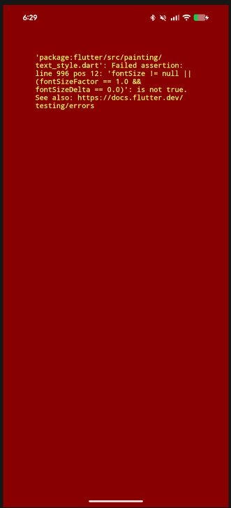

# NutriSense — Current Success & System Status

This document provides a comprehensive inventory of all features, services, database schemas, and verification results across the **NutriSense** platform.

---

## 🏆 Completed Milestones & Feature Inventory

### 1. Core Platform & User Profiles
* **Conversational Onboarding**: Captures age, gender, weight, height, budget in PKR, medical conditions, diet restrictions, and goals.
* **Personalized Macro Targets**: Auto-computes and saves daily targets for calories, protein, carbs, and fats.
* **Bilingual Localization**: Full cross-screen English and Urdu Nastaleeq translation with dynamic RTL/LTR adjustment.
* **Pakistani Natural Radial Theme**: Vibrant Emerald Green and Islamic Gold radial gradient background with subtle nutrition background geometry.

### 2. Multimodal Meal & Hydration Tracking
* **AI Image Scan-to-Log (Gemini Vision)**: Instant camera scanning calibrated for South Asian portion conventions (*katori, roti, naan*) and cooking oil/tarka macro calculations.
* **Non-blocking Live Corrections**: Food name and portion editing with instant macro recalculation.
* **Barcode Scanner**: `mobile_scanner` + OpenFoodFacts integration with automated allergy and medical cross-referencing.
* **Manual Meal Logger**: Form with AI-powered search auto-fill.
* **Advanced Hydration Selector**: Standard cups/bottles and dynamic milliliter logging with Ramadan-specific hydration schedules.

### 3. Ramadan Fasting Suite
* **Automatic & Manual Mode**: Hijri date detection with manual override in Settings.
* **Dynamic Meal Slot Renaming**: Automatically adjusts meal keys to *Sehri*, *Iftar*, *Post-Iftar Dinner*, and *Taraweeh Snack*.
* **Live Countdown Clocks**: Dual real-time countdown clocks for Sehri and Iftar for local Pakistani timezones.
* **Ramadan Health Rules**: Suppresses daytime eating alerts while fasting, enforces split hydration, and tunes AI Coach responses for fasting nutrition.

### 4. 👨‍👩‍👧‍👦 Family Profiles (خاندانی پروفائلز)
* **Supabase Integration**: `family_members` table with `user_id` foreign key and `family_member_id` foreign key on `meal_logs`.
* **Family Management Screen (`family_view.dart`)**: Comprehensive dependent manager for children, elderly parents, spouses, and siblings with condition chips and dietary restrictions.
* **Intelligent Macro Calculator**: Automatically calculates age-, gender-, and condition-tailored targets (e.g. child development vs elderly diabetic parents).
* **1-Tap Dashboard Switcher**: Top avatar pill bar (`[🧑 Me] [👧 Ayesha] [👴 Abu] [+ Family]`) dynamically filtering calorie rings, macro targets, and logged meals.
* **Per-Dependent Meal Logging**: Attribute camera scans or manual logs to specific family members.

### 5. 📊 Backend Report Service & PDF Weekly Report
* **FastAPI Analytics API (`/api/v1/reports/weekly`)**: 7-day adherence aggregation, macro distribution trends, and clinical narrative reviews generated by Gemini.
* **Zero-Dependency PDF Generator (`/api/v1/reports/weekly/pdf`)**: Pure-Python PDF 1.4 binary stream generator producing downloadable clinical PDF reports directly into the user's `Downloads` folder.
* **Interactive Frontend Report Screen**: Clickable 7-day macro charts, AI progress analysis, and direct PDF download.

### 6. 🔔 Smarter Notification System
* **Adaptive Meal Reminders**: Automatically learns user's routine eating hours via exponential moving average and sends personalized prompts.
* **Streak Milestone Celebrations**: Fires celebratory notifications on 3, 5, 7, 10, 14, 30 days.
* **Evening Streak Saver (8:30 PM)**: Scheduled daily to remind users before midnight to prevent broken streaks.
* **AI Clinical Safety & Risk Alerts**: High-priority alert dispatch when Gemini detects dangerous metabolic patterns.
* **Ramadan Alarms**: 30-min Sehri countdown alert, Iftar sunset alert, and night hydration alerts.

### 7. 🛒 Smart Grocery List Generator
* **Automated Shopping Lists**: Converts logged meals and weekly plans into categorized, checkable grocery lists with bilingual names.

### 8. 📱 Cross-Platform Health Sync Dashboard
* **Physical Activity Overlay**: Synchronizes daily steps, active calories burned, sleep, and heart rate across Android (Health Connect), iOS (Apple Health), and Windows/Web (simulation telemetry).

### 9. 📴 Offline-First SQLite Sync Engine
* **Idempotent Dual-Write Cache**: SQLite local storage (`nutrisense_offline.db`) storing meal/water logs with UUID v4 `sync_id` idempotency keys preventing duplicate uploads during network reconnections.

### 10. 🛡️ AI Agentic Safety Pipeline
* **3-Step Clinical Architecture**: Retrieval (RAG) $\to$ Contextual Coaching $\to$ Independent Risk Evaluator.
* **Care Locator**: Integrated "Find Affordable Care" button linking users to nearby government hospitals and private clinics with 1-tap call/directions.

---

## 🧪 Current Verification Status

- **Static Analysis**: `flutter analyze` $\to$ **`No issues found!`** (0 errors, 0 warnings).
- **Automated Test Suite**: `flutter test` $\to$ **`All tests passed!`**.
